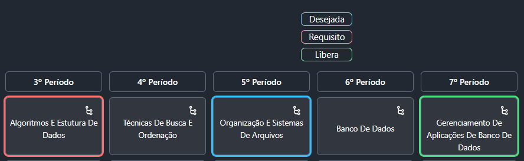
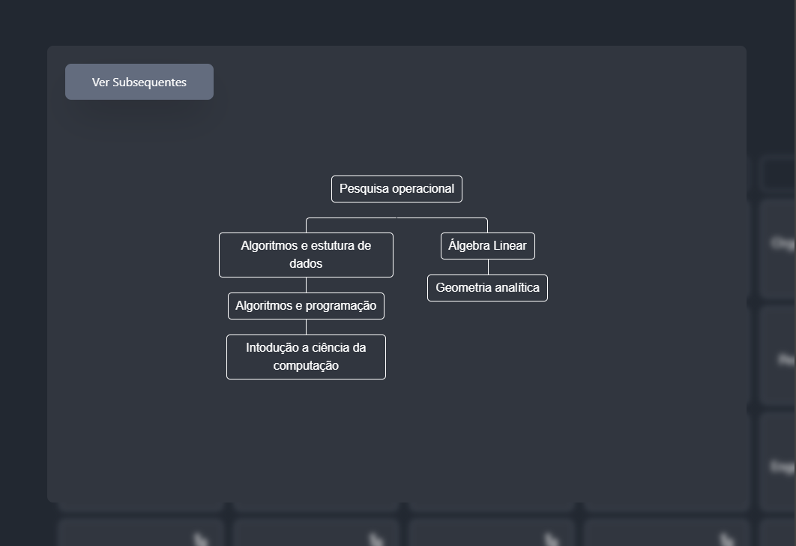

# Fluxograma de disciplinas


## Sobre o Projeto


Este projeto é voltado para auxiliar estudantes do IFNMG - Campus Montes Claros do curso de Ciência da Computação a terem uma visualização clara e interativa do fluxograma curricular do curso, permitindo que o usuário veja os requisitos completos de uma disciplina bem como as disciplinas subsequentes desta mesma.

Apesar de conter inicialmente apenas o fluxograma do curso de Ciência da computação, demais fluxos podem ser adicionados alterando o mapeamento das relações no código.

``` js
disciplinas.set("tbo", { preReq: ["aeds"], posReq: ["paa"] });
disciplinas.set("osa", { preReq: ["aeds"], posReq: ["bd2"] });
disciplinas.set("po", { preReq: ["aeds", "algebra"], posReq: [] });
.
.
.
```

Os requisitos e disciplinas subsequentes imediatas podem ser vizualizadas ao acionar o hover em uma disciplina de interesse. A árvore completa com todos requisitos ou disciplinas subsequentes podem ser acessadas ao clicar no ícone de cada disciplina.





## Tecnologias utilizadas


<div style="display: inline_block">
  &nbsp; &nbsp; &nbsp; &nbsp;
  
</div><br>

## Atualizações futuras


- Alterar árvore completa ao selecionar pela própria árvore

- Adicionar fluxogramas para diferentes PPC's